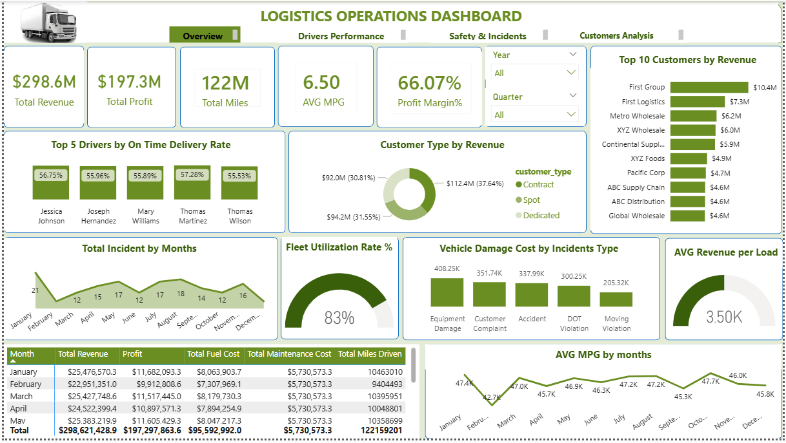
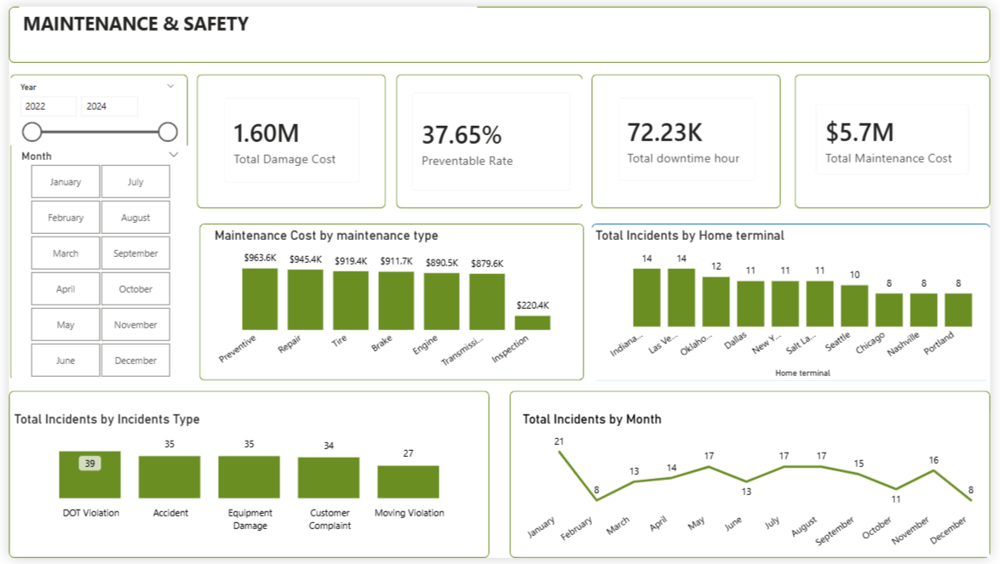
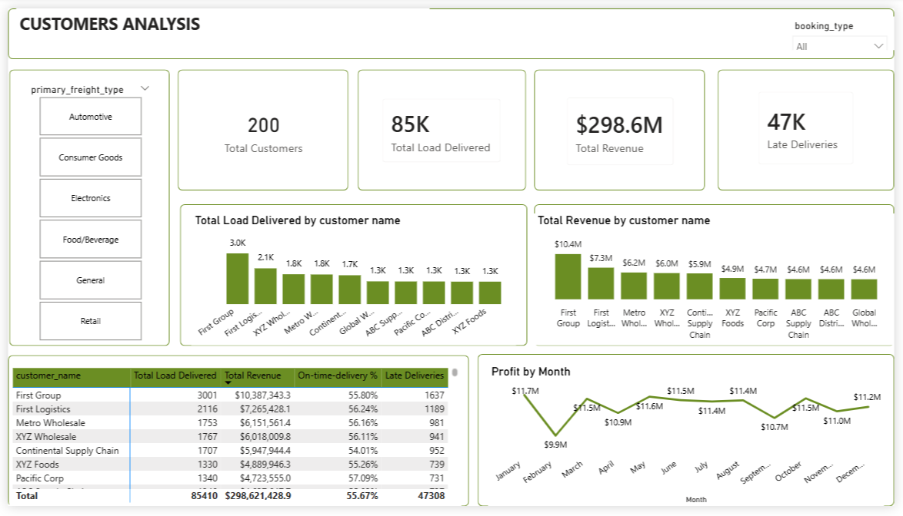
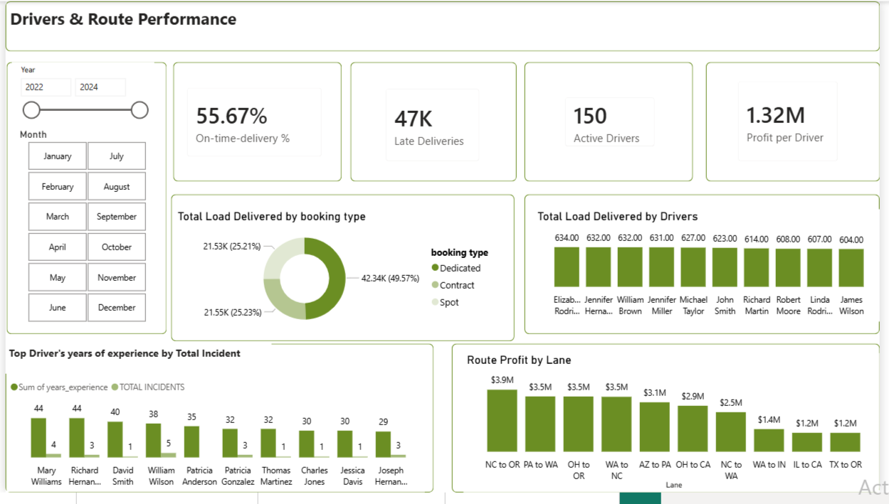

# 🚛 Logistics Operations Dashboard — Power BI


---

## 📋 Table of Contents

- [Project Overview](#project-overview)
- [Dashboard Pages](#dashboard-pages)
- [Dataset Information](#dataset-information)
- [Project Objectives](#project-objectives)
- [Tools & Technologies](#tools--technologies)
- [Data Cleaning & Preparation](#data-cleaning--preparation)
- [Data Model & Relationships](#data-model--relationships)
- [DAX Measures](#dax-measures)
- [Key Metrics Summary](#key-metrics-summary)
- [Key Insights](#key-insights)
- [Business Recommendations](#business-recommendations)
- [Project Workflow](#project-workflow)
- [Folder Structure](#folder-structure)
- [Skills Demonstrated](#skills-demonstrated)
- [Results Summary](#results-summary)
- [Future Improvements](#future-improvements)
- [Conclusion](#conclusion)

---

## 📌 Project Overview

This project delivers a fully interactive **4-page Power BI dashboard** analysing the end-to-end operations of a US-based trucking and logistics company. The analysis covers 85,410 loads, 150 active drivers, 200 customers, and 122 million miles of freight movement across a three-year period from 2022 to 2024.

### The Business Problem
Trucking operations generate data across multiple disconnected systems — loads, trips, fuel purchases, maintenance records, delivery events, and safety incidents. Without a unified analytical view, operations managers cannot see which routes are profitable, which drivers are underperforming, where safety incidents are concentrated, or which customers are generating the most value. Decisions get made on intuition rather than evidence.

### Why This Analysis Matters
With $298.6 million in total revenue and only a 55.67% on-time delivery rate, this business is generating strong top-line numbers while quietly experiencing a service quality crisis. Nearly half of all 85,410 deliveries arrived late. The dashboard surfaces these issues and provides the granularity needed to act on them.

### Objective
To connect 14 tables of operational logistics data into a single Power BI model, build a suite of DAX measures covering revenue, profitability, safety, and service quality, and deliver a four-page interactive dashboard that answers the most critical business questions across operations, driver management, fleet safety, and customer analysis.

---

## 📊 Dashboard Pages

### Page 1 — Overview
The executive summary page showing headline KPIs, top 10 customers by revenue, customer type revenue split, monthly incident trend, fleet utilization gauge, vehicle damage cost by incident type, average revenue per load, and a monthly financial summary table.


### Page 2 — Drivers & Route Performance
Covers on-time delivery rate, late delivery count, active driver count, profit per driver, booking type split (Dedicated / Contract / Spot), total loads delivered by driver, driver experience vs incident rate, and route profit by lane.


### Page 3 — Maintenance & Safety
Tracks total damage cost, preventable incident rate, total downtime hours, total maintenance cost, maintenance cost by type, incidents by home terminal, incident type breakdown, and monthly incident trend.


### Page 4 — Customers Analysis
Analyses total customers, total loads delivered, total revenue, late deliveries by customer, load volume and revenue ranking by customer name, and monthly profit trend.


---

## 🗂 Dataset Information

| Attribute | Details |
|---|---|
| **Total Tables** | 14 connected tables |
| **Total Loads** | 85,410 |
| **Total Customers** | 200 |
| **Active Drivers** | 150 |
| **Total Miles Driven** | 122,159,201 |
| **Period Covered** | January 2022 – December 2024 |
| **Model Type** | Star schema with central Date table |

### Tables in the Data Model
| Category | Tables |
|---|---|
| **Dimensions** | customers, drivers, trucks, trailers, routes, facilities |
| **Facts** | loads, trips, fuel_purchases, maintenance_records, delivery_events, safety_incidents |
| **Aggregates** | driver_monthly_metrics, truck_utilization_metrics |

---

## 🎯 Project Objectives
- Measure total revenue, profit, and margin across the 3-year operation
- Identify which customers and routes generate the highest revenue and profit
- Evaluate on-time delivery performance against industry benchmarks
- Analyse driver performance across loads delivered, revenue, and safety incidents
- Assess fleet utilisation and average fuel efficiency (MPG)
- Break down maintenance costs by type to support budget planning
- Identify preventable safety incidents and their financial impact
- Surface which home terminals have the highest incident concentration
- Measure route profitability by lane to guide pricing and load acceptance decisions
- Track monthly profit trends to identify seasonal patterns

---

## 🛠 Tools & Technologies
| Tool | Purpose |
|---|---|
| **Power BI Desktop** | Data modelling, DAX measures, and dashboard development |
| **Power Query (M)** | Data cleaning, type standardisation, and transformation |
| **DAX** | Custom KPIs, calculated measures, and time intelligence |
| **Star Schema** | Relationship modelling across 14 tables |
| **SQL** | Source data validation and cross-table join queries |
| **Excel / CSV** | Source data format |

---

## 🧹 Data Cleaning & Preparation
All cleaning was performed in Power Query before the data entered the Power BI model.
- **Removed duplicate records** across all 14 tables
- **Fixed data types** on every column
- **Standardised text columns** including city names, event types, order statuses, and booking types
- **Handled missing values** by column
- **Created a central Date table** with Year, Quarter, Month Number, Month Name, and Month-Year columns
- **Built all relationships** in Model view — one-to-many with single-direction filtering
- **Disabled Auto Date/Time** in Power BI settings

---

## 🔗 Data Model & Relationships
The full data model was built in Power BI Model view using a star schema pattern. All 14 tables are connected through clearly defined one-to-many relationships with single-direction filtering.

### Relationship Diagram


---

## 📐 DAX Measures

### Measure Screenshots
**AVG MPG**  


**Total Miles Driven**  


**Total Incidents**  


**Fuel Cost per Lane**  


**Total Downtime Hour**  


**Total Maintenance Cost**  


**Total Load Delivered**  


**Revenue % by Customer Type**  


**Profit Margin %**  


**Profit per Driver**  


**Late Deliveries**  


**Active Drivers**  


**On-time-delivery %**  


**Total Customers**  


### Full Measure Reference
| Measure | Table | Format | Formula |
|---|---|---|---|
| AVG MPG | driver_monthly_metrics | General | `AVERAGE(driver_monthly_metrics[average_mpg])` |
| Total Miles Driven | trips | Whole Number | `SUM(trips[actual_distance_miles])` |
| TOTAL INCIDENTS | safety_incidents | Whole Number | `COUNTROWS(safety_incidents)` |
| Fuel Cost per Lane | routes | Whole Number | `DIVIDE(SUM(fuel_purchases[total_cost]), SUM(routes[Lane]))` |
| Total downtime hour | maintenance_records | General | `SUM(maintenance_records[downtime_hours])` |
| Total Maintenance Cost | maintenance_records | Currency | `SUM(maintenance_records[total_cost])` |
| Total Load Delivered | loads | Decimal Number | `COUNTROWS(loads)` |
| Revenue % by customer type | loads | General | `DIVIDE([Total Revenue], CALCULATE([Total Revenue], ALL(customers[customer_type])))` |
| Profit Margin% | loads | Percentage | `DIVIDE(routes[Route Profit], [Total Revenue])` |
| Profit per Driver | drivers | General | `DIVIDE(routes[Route Profit], DISTINCTCOUNT(drivers[driver_id]))` |
| Late Deliveries | drivers | Whole Number | `CALCULATE(COUNTROWS(delivery_events), delivery_events[event_type] = "Delivery", delivery_events[on_time_flag] = FALSE)` |
| Active Drivers | drivers | Whole Number | `DISTINCTCOUNT(drivers[driver_id])` |
| On-time-delivery % | driver_monthly_metrics | Percentage (2dp) | `DIVIDE(COUNTROWS(FILTER(delivery_events, delivery_events[on_time_flag]=TRUE)), COUNTROWS(delivery_events))` |
| Total Customers | customers | Whole Number | `DISTINCTCOUNT(customers[customer_id])` |

---

## 📈 Key Metrics Summary
### Overview
| Metric | Value |
|---|---|
| Total Revenue | **$298.6M** |
| Total Profit | **$197.3M** |
| Total Miles Driven | **122M** |
| Average MPG | **6.50** |
| Profit Margin | **66.07%** |
| Fleet Utilisation Rate | **83%** |

### Drivers & Route Performance
| Metric | Value |
|---|---|
| On-Time Delivery Rate | **55.67%** |
| Late Deliveries | **47,308** |
| Active Drivers | **150** |
| Top Lane by Profit | **NC → OR ($3.9M)** |

### Maintenance & Safety
| Metric | Value |
|---|---|
| Total Damage Cost | **$1.60M** |
| Preventable Incident Rate | **37.65%** |
| Total Downtime Hours | **72,230** |

### Customers Analysis
| Metric | Value |
|---|---|
| Total Customers | **200** |
| Total Loads Delivered | **85,410** |
| Top Customer by Revenue | **First Group ($10.4M)** |

---

## 💡 Key Insights
1. **On-time delivery is the most critical operational failure.** 55.67% OTD vs 90%+ industry standard.
2. **The lateness is not a driver capacity problem.** Delays from detention at customer facilities.
3. **Fleet utilisation at 83%** leaves meaningful headroom.
4. **NC → OR lane is the most profitable** at $3.9M.
5. **37.65% of safety incidents were preventable.** $1.60M damage cost.
6. **DOT violations are the most frequent** incident type at 39 cases.
7. **Indianapolis and Las Vegas terminals** carry the highest incident load.
8. **First Group is the anchor customer** at $10.4M.

---

## 📢 Business Recommendations
1. Investigate detention at customer facilities before adding capacity.
2. Launch targeted safety coaching programme at Indianapolis and Las Vegas.
3. Reprice underperforming lanes based on cost-per-mile analysis.
4. Develop a key account service programme for the top 10 customers.
5. Build a fleet replacement schedule for high-maintenance assets.
6. Review Dedicated booking rates against current market conditions.

---
```
## 🔄 Project Workflow

```
14 Raw Source Tables (CSV / Excel)
           
            
            
            │
            ▼
  
  
  
  Data Cleaning in Power Query
  
  
  
  ├── Remove duplicates
  
  
  ├── Fix data types
 
  
  
  ├── Standardise text columns
  
  
  
  ├── Handle missing values
 
  
  
  └── Build central Date table
           
            
            
            │
            ▼
  Data Modelling (Star Schema)
 
  
  ├── Define relationships (1-to-many)
  
  
  ├── Set filter directions (single)
  
  
  └── Connect Date table to all facts
      
            
            
            │
            ▼
  DAX Measures
  
  
  ├── Revenue, Profit, Margin %
  
  
  ├── On-Time Delivery %
  
  
  ├── Late Deliveries count
  
  
  ├── Fleet Utilisation Rate
  
  
  ├── Preventable Incident Rate
  
  
  └── Cost per Mile
           
            
            
            │
            ▼
 4-Page Interactive Dashboard
  
  
  ├── Page 1: Overview
  
  
  ├── Page 2: Drivers & Route Performance
  
  
  ├── Page 3: Maintenance & Safety
  
  
  └── Page 4: Customers Analysis
           
            
            
            │
            ▼
  Key Insights & Business Recommendations
```

## 📁 Folder Structure
Logistics-Operations-Dashboard/
│
├── Data/

│   ├── customers.csv

│   ├── drivers.csv

│   ├── trucks.csv

│   ├── trailers.csv

│   ├── routes.csv

│   ├── facilities.csv

│   ├── loads.csv

│   ├── trips.csv

│   ├── fuel_purchases.csv

│   ├── maintenance_records.csv

│   ├── delivery_events.csv

│   ├── safety_incidents.csv

│   ├── driver_monthly_metrics.csv

│   └── truck_utilization_metrics.csv

│
├── Dashboard/

│   └── Logistics_Operations_Dashboard.pbix
│
├── SQL/
│   └── validation_queries.sql
│

├── Images/

│   ├── LOGIS.png                  ← Overview page

│   ├── LOGIS2.png                 ← Drivers & Route Performance

│   ├── LOGIS3.png                 ← Maintenance & Safety

│   ├── LOGIS1.png                 ← Customers Analysis

│   ├── model_view.png             ← Data model relationship diagram

│   ├── dax_avg_mpg.png            ← AVG MPG measure

│   ├── dax_total_miles.png        ← Total Miles Driven measure

│   ├── dax_total_incidents.png    ← Total Incidents measure

│   ├── dax_fuel_cost_per_lane.png ← Fuel Cost per Lane measure

│   ├── dax_downtime.png           ← Total Downtime Hour measure

│   ├── dax_maintenance_cost.png   ← Total Maintenance Cost measure

│   ├── dax_total_loads.png        ← Total Load Delivered measure

│   ├── dax_revenue_pct.png        ← Revenue % by Customer Type measure

│   ├── dax_profit_margin.png      ← Profit Margin % measure

│   ├── dax_profit_per_driver.png  ← Profit per Driver measure

│   ├── dax_late_deliveries.png    ← Late Deliveries measure

│   ├── dax_active_drivers.png     ← Active Drivers measure

│   ├── dax_otd.png                ← On-time-delivery % measure

│   └── dax_total_customers.png    ← Total Customers measure

│
└── README.md
```
```
```
---

## 🧠 Skills Demonstrated

| Skill | Evidence |
|---|---|
| **Data Modelling** | 14-table star schema with one-to-many relationships |
| **Power Query** | Cleaning, type fixing, deduplication, and Date table creation |
| **DAX Measures** | Revenue, margin, OTD%, cost per mile, preventable incident rate |
| **Time Intelligence** | Central Date table with year, quarter, month slicers |
| **Dashboard Design** | 4-page interactive report with consistent green/white design system |
| **KPI Selection** | Headline metrics chosen for operational and executive relevance |
| **Multi-table Modelling** | 14 tables connected in a clean star schema |
| **Data Storytelling** | Findings framed as business problems with actionable implications |
| **Business Analysis** | Recommendations grounded in specific data patterns |
| **SQL Validation** | Cross-table joins used to verify model accuracy pre-visualisation |

---

## 📝 Results Summary

This project transforms 14 connected logistics tables — covering 85,410 loads, 150 drivers, 200 customers, and 122 million miles of operations — into a four-page interactive Power BI dashboard that gives logistics managers complete visibility into their business. The analysis uncovered a 55.67% on-time delivery rate against an industry standard above 90%, identified the NC → OR lane as the most profitable at $3.9M, found that 37.65% of safety incidents were preventable, and revealed that Indianapolis and Las Vegas terminals carry disproportionate incident risk. Total revenue of $298.6M is strong, but the service quality picture demands operational attention before customer contracts come up for renewal. The dashboard equips decision-makers to address these issues with evidence rather than instinct.

---

## 🚀 Future Improvements

- **Predictive on-time delivery model** — identify at-risk loads before dispatch using historical trip patterns
- **Driver drill-through detail page** — click any driver name to open a full performance profile 
- **Lane profitability map** — US route map with lines coloured by profit per mile
- **Maintenance cost forecasting** — project next-quarter maintenance spend by truck
- **Real-time data refresh** — connect the model to SQL Server or Azure
- **Customer churn risk indicator** — flag accounts whose OTD rate has declined 3 months straight

---

## ✅ Conclusion

This logistics operations dashboard demonstrates what becomes possible when operational data is treated as a strategic asset rather than a by-product of daily activity. By connecting 14 tables, building a clean star schema, and developing targeted DAX measures, the project delivers a tool that gives logistics leadership visibility into every dimension of the operation. The central finding — that more than 44% of deliveries arrive late despite strong revenue performance — is the kind of insight that only surfaces when operational data is connected and examined as a whole.

---

## 👤 Author

**Eke Deborah** — Data Analyst | Power BI · SQL · Python · Excel

- 🔗 [LinkedIn](https://www.linkedin.com/in/your-linkedin)
- 📧 your.email@gmail.com
- 🐙 [GitHub](https://github.com/your-username)

---
*Built as part of a data analytics portfolio. Dataset covers a simulated US trucking operation spanning 2022–2024.*
